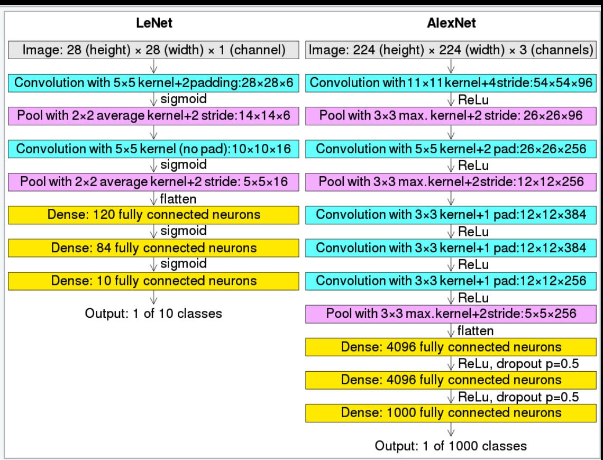

# Dive Into Deep Learning（pytorch）

原版：https://d2l.ai/

中文版：https://zh.d2l.ai/

B站pytorch教程（小土堆）：https://www.bilibili.com/video/BV1hE411t7RN/

## 实操中实现了的项目

- 基于卷积神经网络(CIFAR 10 quick model)的性别识别系统（原来直接用线性回归的，后面发现效果太差，改了）

- 基于AlexNet实现的图片分类卷积神经网络（由于数据集小，训练效果不佳）

  

## 包含的数据集

- 蚂蚁蜜蜂分类数据集：在 动手深度学习/练手数据集 中
  - 其中单类样本数为100左右
- 性别分类数据集：在 动手深度学习/实操/基于softmax线性回归的性别识别系统 中
  - 其中单类样本数为10k左右
- 120种狗数据集：[stanford-dogs-dataset](https://www.kaggle.com/datasets/jessicali9530/stanford-dogs-dataset)
  - 其中单类样本数为200左右
