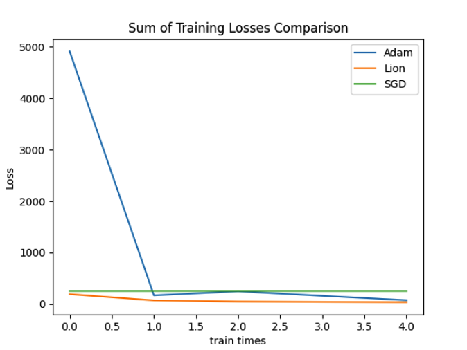
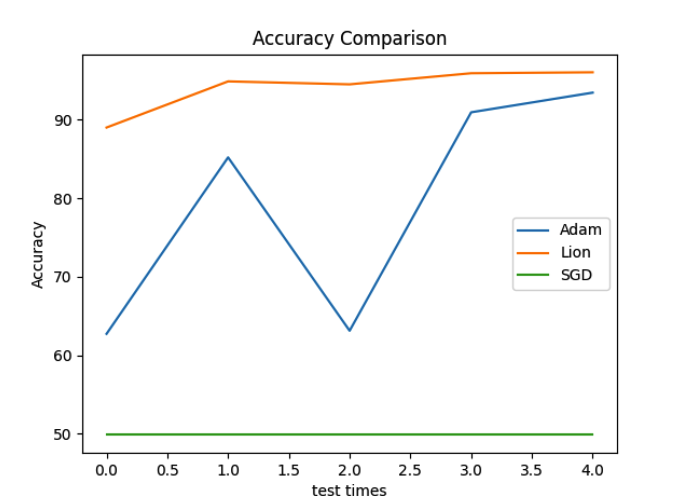

# 网络功能

对input data进行分类

# 网络结构

## 网络结构分析

- 网络输入是一张32x32像素的3通道图片
- 由于我们的网络最后的结果是要二分类，因此最后的output线性层是用的 to 2的结构，这和上图不同
- 输入到第一层特征图中间是一个卷积层，从3通道到32通道，核大小为5，因此在代码中写``Conv2d(3, 32, 5, padding=2)``。至于为什么padding要等于2，这是因为基于pytorch官网的公式和上图，我们计算出来padding为2就能够满足输出为32x32的大小
- 然后是一个max池化层，核大小为2，直接写``MaxPool2d(2)``就行
- 后面的卷积和池化层就略过了
- 然后是Flatten层，也就是将倒数第三层64个通道的4x4的图展开成一维像素。这也就意味着，Flatten层过后得到的是长度为64x4x4=1024的向量
- 最后的线性层就直接1024 to 2即可。当然，我的代码用于二分类，因此是1024 to 2
- 实际上代码中有两个线性层，分别是1024 to 64,64 to 2(我只是想试试增加参数对准确率的效果)

# 网络复现

## 代码

代码在main.py中，运行完后的模型存放在CIFAR10_Model.pth中

使用训练好的模型进行预测的代码是useTrainedModel.py

## 实验效果

我尝试了不同的优化器：经典的SGD，Adam，以及google最新的Lion优化器

事实证明，Lion优化器名副其实。

模型训练loss

模型测试节点loss和

模型准确率

我感觉SGD应该是出了什么问题，可能代码没写好，但是懒得改了。
